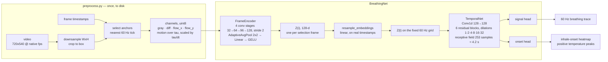

# CNN + TCN baseline

A learned baseline for the [Breathing from Video Challenge](https://www.codabench.org):
a per-frame CNN over a snout crop feeds a dilated TCN that reconstructs the
thermistor breathing trace.

This package sits alongside `baseline/`, which stays the intentionally simple
optical-flow reference that participants read first. Nothing here changes that
package or its Docker image.

## Architecture



The encoder's final pooling keeps a 2x2 grid rather than collapsing to one
vector, to preserve directional motion signal. The TCN is non-causal (offline
inference).

Both geometry choices are made by hand in
[`annotate.py`](src/breathing_cnn_tcn/annotate.py): the **downsample target**
sets how much detail survives, and the **crop box** sets how much of the frame
the model sees. The box is placed on the downsampled frame, so preprocessing
scales before cropping and there is no second rescale — what you crop is the
model's input shape.

### Frame rate is not assumed anywhere

Three time grids:

| grid | rate | carries |
| --- | --- | --- |
| native | camera fps (240, ~504, …) | decoded frames, timestamp parquet |
| selection | `--select-fs`, default 60 Hz | cached feature array, one CNN input each |
| output | fixed 60 Hz | TCN output, targets, submissions, every metric |

Selection picks the native frame nearest each tick of a grid built from the
clip's own timestamps (not a fixed frame-count stride, which only lands on an
exact rate when native fps is a multiple of it).

Motion channels are measured against the frame nearest `t - tau`
(`tau = 16.67 ms`) and scaled by `tau / dt` (the achieved interval), so `diff`
and flow mean the same thing at any frame rate.

Selection and output grids are reconciled after the CNN by interpolating frame
embeddings ([`model.resample_embeddings`](src/breathing_cnn_tcn/model.py)),
not on pixels.

## Getting started

All commands run from the repo root.

```bash
uv sync --all-packages --extra train
```

**1. Data** (~11 GiB, public bucket, no credentials).

```bash
aws s3 sync --no-sign-request s3://aind-scratch-data/vr-foraging/codabench-breathing-challenge/3fd049f3b2d5bb39409611187918ac41ce1f8b0a0d8d113a3526e5cf5a2ebc08/public/train/ data/train/
```

**2. Crop boxes** ship with the repo as `baseline-cnn-tcn/artifacts/session_boxes_face.json`.
Nothing to do unless you want to change them — see [Choosing crops](#choosing-crops).

**3. Preprocess** — decode, downsample, crop, channelise. ~45 min, ~20 GiB.

```bash
uv run python -m breathing_cnn_tcn.preprocess --boxes-json baseline-cnn-tcn/artifacts/session_boxes_face.json
```

**4. Train.** Checkpoints land in `runs_all/baseline-cnn-tcn/<timestamp>/` as
`best.pt`, `last.pt`, `history.json`, `best_per_clip.json`. Every non-reserved
session trains together; defaults match the settings behind the shipped model.

```bash
uv run python -m breathing_cnn_tcn.train
```

`--channels` picks which of the four stored channels the model is trained on —
`gray`, `diff`, `flow_x`, `flow_y`, plus the groups `flow` (both flow planes)
and `all`. Preprocessing always writes all four, so this selects without
reprocessing: every variant reads byte-identical crops and shares one
`channel_stats.json`. The selection lands in the run directory name and in the
checkpoint, so `evaluate` and `submit` need no extra flags.

```bash
uv run python -m breathing_cnn_tcn.train --channels gray          # appearance only
uv run python -m breathing_cnn_tcn.train --channels gray+diff     # no optical flow
uv run python -m breathing_cnn_tcn.train --channels diff+flow     # motion only
```

Each of those is a model trained from scratch on those channels alone — not one
4-channel model with inputs masked — so comparing them measures what training
with the extra channels buys. Two caveats when you do: augmentation is not
channel-neutral (a `gray` run gets no motion rescaling, a `diff+flow` run no
brightness/contrast jitter), and `gray` alone is not a motion-free model, since
the TCN still sees how the frame embeddings evolve.

**5. Evaluate** on the reserved sessions, scored the way the competition scores.
Several `--checkpoint` paths are ensembled; add `--plot` for the rate-breakdown
and reserved-grid diagnostic plots too (needs exactly one `--checkpoint`, since
the reserved-grid panel reads one model's own onset head).

```bash
uv run python -m breathing_cnn_tcn.evaluate --checkpoint runs_all/baseline-cnn-tcn/<timestamp>/best.pt --plot
```

Those sessions are consumable: every look influences what you try next, so score
a model you are ready to commit to, not every intermediate.

## Fixed train/test factorial benchmark

The organizer benchmark is separate from the legacy three-session development
holdout above. It trains on all 16 labelled training recordings for a fixed
budget, then evaluates on 12 independent test recordings. The test manifest
retains two important strata: six recordings from new animals and six new dates
from animals represented in training.

The checked-in [`benchmark.toml`](artifacts/benchmark.toml) expands four input
representations (`gray`, `diff`, `flow`, `gray+flow`) by two objectives
(signal-only and signal+onset multitask) by five seeds: 40 jobs. Add
`"gray+diff+flow"` to `representations` if the current all-channel default should
be included as a fifth reference level.

Download only the face camera and overlay the private test thermistors without
flattening the train/test directories:

```bash
uv run --package breathing-cnn-tcn python -m breathing_cnn_tcn.benchmark_data download
uv run --package breathing-cnn-tcn python -m breathing_cnn_tcn.benchmark_data validate
```

Preprocess both splits. Even though the reconstructed test directory carries
thermistors, `preprocess` deliberately creates targets only for `train`; test
truth remains outside the training feature manifest.

```bash
uv run --package breathing-cnn-tcn python -m breathing_cnn_tcn.preprocess \
  --packaged-root data/benchmark --split train \
  --out-dir data/features-benchmark \
  --boxes-json baseline-cnn-tcn/artifacts/session_boxes_face.json

uv run --package breathing-cnn-tcn python -m breathing_cnn_tcn.preprocess \
  --packaged-root data/benchmark --split test \
  --out-dir data/features-benchmark \
  --boxes-json baseline-cnn-tcn/artifacts/session_boxes_face.json
```

Inspect the expansion, run it, and collect session-level results:

```bash
uv run --package breathing-cnn-tcn python -m breathing_cnn_tcn.benchmark plan
uv run --package breathing-cnn-tcn --extra train python -m breathing_cnn_tcn.benchmark run
uv run --package breathing-cnn-tcn --extra train python -m breathing_cnn_tcn.benchmark collect
```

`run --dry-run` prints commands without touching the output directory. Rerunning
`run` automatically resumes a partial job from its `last.pt`; use `--no-resume`
to make partial output an error. Checkpoints include optimizer, scheduler, EMA,
mixed-precision scaler, global step, and Python/NumPy/PyTorch RNG states. At most
the unfinished epoch is repeated after a process or machine crash. Exact per-job
directories prevent one sweep member from resuming another.

`collect` writes one structured `results.json` containing per-session metrics,
per-seed summaries, and mean/SD/median/min/max summaries across seeds for the
combined test set and both animal-generalization strata. Each run also retains
its complete `evaluation.json`. Individual models remain separate; collection
does not silently turn the five seeds into an ensemble.

### Choosing crops

One box per session, placed by hand. There is no detector and no fallback:
`preprocess` refuses to run without a box for every clip, because a guessed box
fails silently — the arrays look normal and the model never learns. Needs a
display; everything else here runs headless.

```bash
uv run python -m breathing_cnn_tcn.annotate --prepare      # cache one frame per clip, ~10 s
uv run python -m breathing_cnn_tcn.annotate --width 360 --height 270 --box-size 96
```

Click places the box centre. Boxes auto-save on every edit, so the window can be
closed and reopened at any point.

| Key | |
|---|---|
| arrows / shift+arrows | nudge 1 px / 10 px |
| `[` `]` | resize the box on every session |
| `n` `p` | next / previous session |
| `1` `2` | switch between the session's two part frames |
| `c` | copy the previous session's box |
| `r` | re-centre on the frame |

The width/height flags set the starting downsample target; it is adjustable in
the window and rescales boxes already placed. The ROI column reads `set` once a
session is placed and `auto` while it still sits at the frame centre.

After re-annotating, re-run preprocess for that session alone:

```bash
uv run python -m breathing_cnn_tcn.preprocess --boxes-json baseline-cnn-tcn/artifacts/session_boxes_face.json --sessions 7
```
